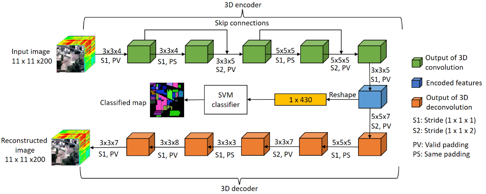

# 3D-Residual-Autoencoder-for-HSI-classification

Hyperspectral images (HSIs) are actively used for landuse/land-cover classification. However, HSIs suffer from the problem of high dimensionality and high spectral-spatial variability leading to requirement of large number of training samples. Deep learning offers several approaches to handle the aforementioned problems but is limited with its own problem of vanishing gradient that creeps in deeper networks (especially CNNs). In this paper, we propose an autoencoder (3D ResAE) that uses 3D convolutions and residual blocks to project the high-dimensional HSI features to a low- dimensional space. 3D convolutions effectively handle the spectral-spatial characteristics whereas, residual block adds an identity mapping, thereby tackling the issue of vanishing gradient. Furthermore, 3D deconvolutions are used to reconstruct the original features, while the network is trained in a semi-supervised manner. Our proposed method is tested on Indian pines and Salinas hyperspectral datasets and the results clearly demonstrate its effectiveness in classification.



# URL to the paper: 
>https://ieeexplore.ieee.org/stamp/stamp.jsp?arnumber=9323359

# Requirement:

```
Keras with Tensorflow 1 as backend
```
# Steps:

```
1. Download the dataset from the provided URL in data folder
```
```
2. Run data_preprocess.py
```
```
3. Run model_code.py
```
# Citation
If using the concept or code, kindly cite the paper as: S. Pande, B. Banerjee. Dimensionality reduction using 3d residual autoencoder for hyperspectral image classification. In The IEEE International Geoscience and Remote Sensing Symposium (IGARSS), July 2020.

You can also use the bibtex as:
```
@inproceedings{pande2020dimensionality,
  title={Dimensionality reduction using 3d residual autoencoder for hyperspectral image classification},
  author={Pande, Shivam and Banerjee, Biplab},
  booktitle={IGARSS 2020-2020 IEEE International Geoscience and Remote Sensing Symposium},
  pages={2029--2032},
  year={2020},
  organization={IEEE}
}
```
